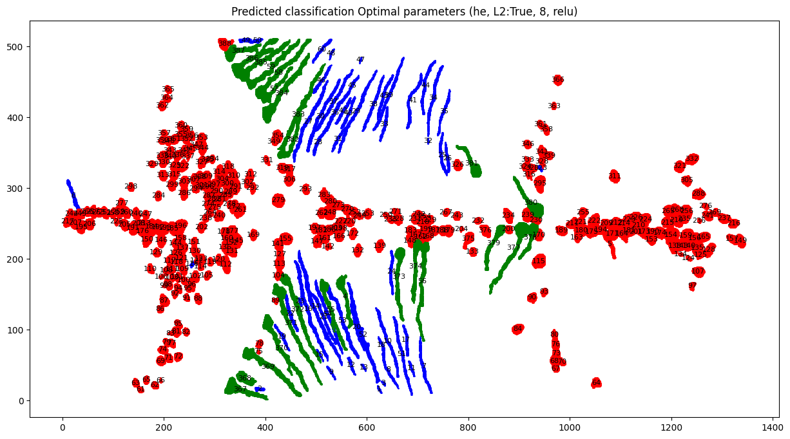
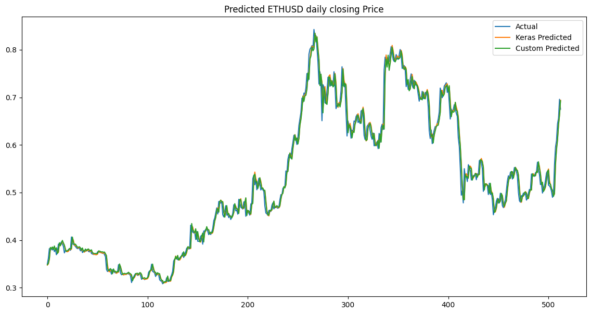

# Project 3 - FYS-STK4155
---

You can explore the results from the project by exploring the [notebooks](ml-p3/notebooks). There are two notebook, one for the [cell classification](ml-p3/notebooks/NN_cell_classification.ipynb) and one for the [LSTM](ml-p3/notebooks/LSTM.ipynb).





## Getting Started

This project is managed by poetry and uses the `pyproject.toml` file to manage dependencies. **Note:** This Project is heavily dependent on the [project 2](https://github.com/javidaf/expert-machine/tree/multi-classification)

If you dont have poetry installed, you can install this as package using pip into a conda environment.

1. create a new conda environment

```bash
conda create -n p3 python= 3.9.20
```

2. Activate the environment

```bash
conda activate p3
```

3. Install the package
```bash
pip install git+https://github.com/javidaf/miniature-octo-waddle.git@master#subdirectory=ml-p3
```


## Basic Usage

THe model weights from the different models are stored in the `models` folder. 
model for cell classification and custom LSTM model are same model that have been 
discussed in the notebooks and in the project report. However I forgot to save the
weights for the keras LSTM model and so there is a different model that is not exactly same as the one in the notebook and the report. 

It is possible to load the models and run predictions on the same dataset discussed in the notebooks and the report. 

**Make sure you have activated the conda environment**

```python
python -m ml_p3
```

## Codebase Description

The codebase is organized into several directories and files, each serving a specific purpose:

- `ml_p3/`: Main package directory containing the core code for the project.
  - `feature_extraction.py`: Contains feature extraction functions for cell classification.
  - `kerasLSTM.py`: Implements the Keras-based LSTM model.
  - `LSTM.py`: Implements a custom LSTM model.
  - `models/`: Directory containing pre-trained model weights.
    - `custom_lstm.pkl`: Pre-trained weights for the custom LSTM model.
    - `he_relu_8_reg.pkl`: Pre-trained weights for another model.
    - `keras_lstm.keras`: Pre-trained weights for the Keras LSTM model.
  - `NN_classification.py`: Implements neural network classification.
  - `optimizer.py`: Contains Adam optimizer spesifically for LSTM becasue the same form p2 was not fully compatible.
  - `plotting.py`: Contains functions for plotting results.
  - `utils/`: Utility functions and classes used throughout the project.

- `notebooks/`: Jupyter notebooks for exploring and visualizing the results.
  - `LSTM.ipynb`: Notebook for LSTM model results.
  - `NN_classifier.ipynb`: Notebook for cell classification classification results.

- `tests/`: Directory containing test cases
  - `data/`: Directory containing test data.


