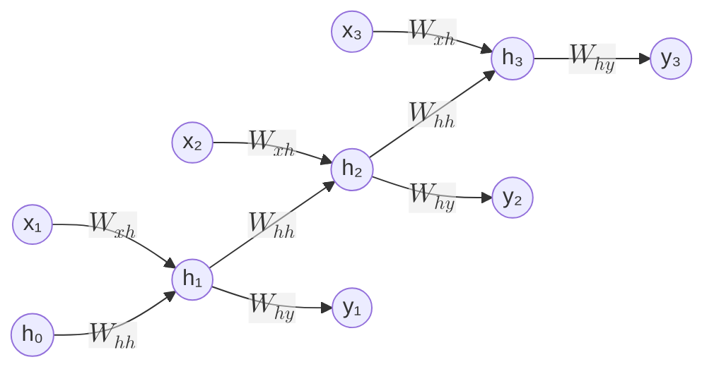
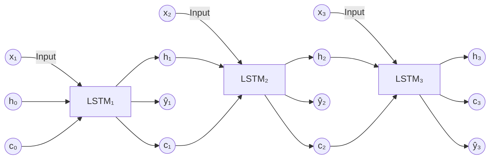
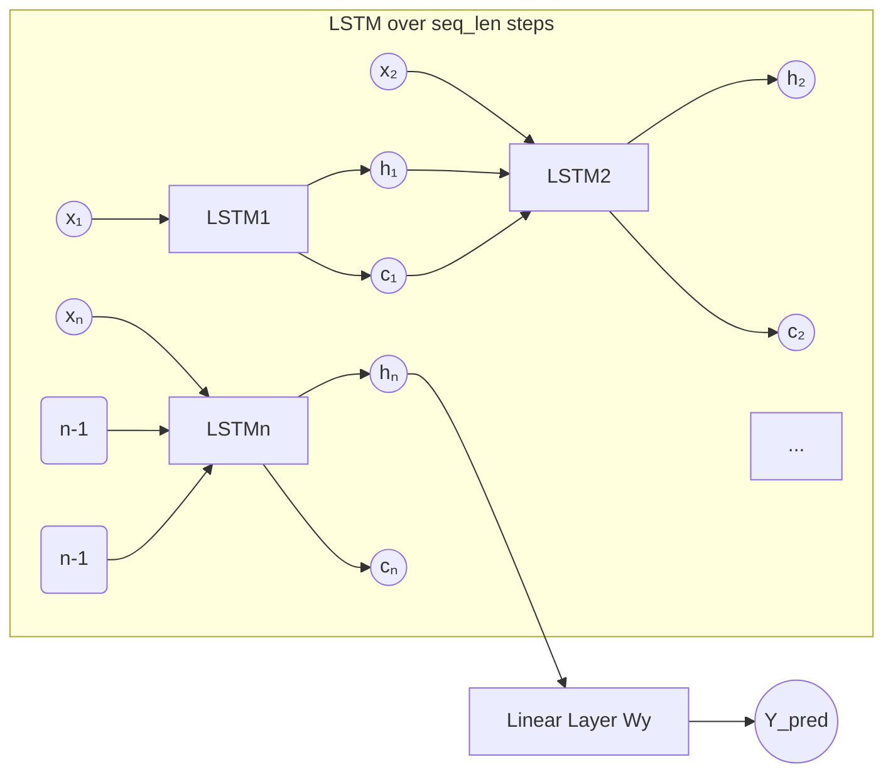
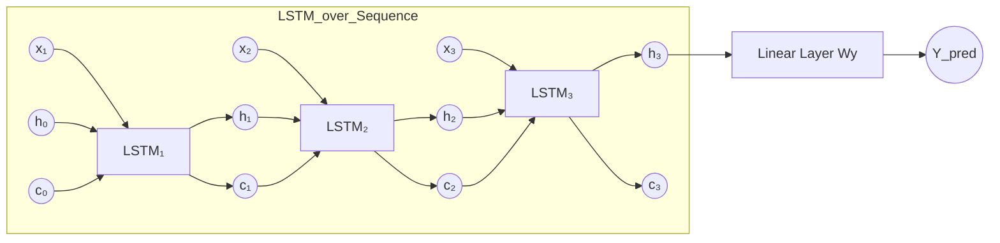
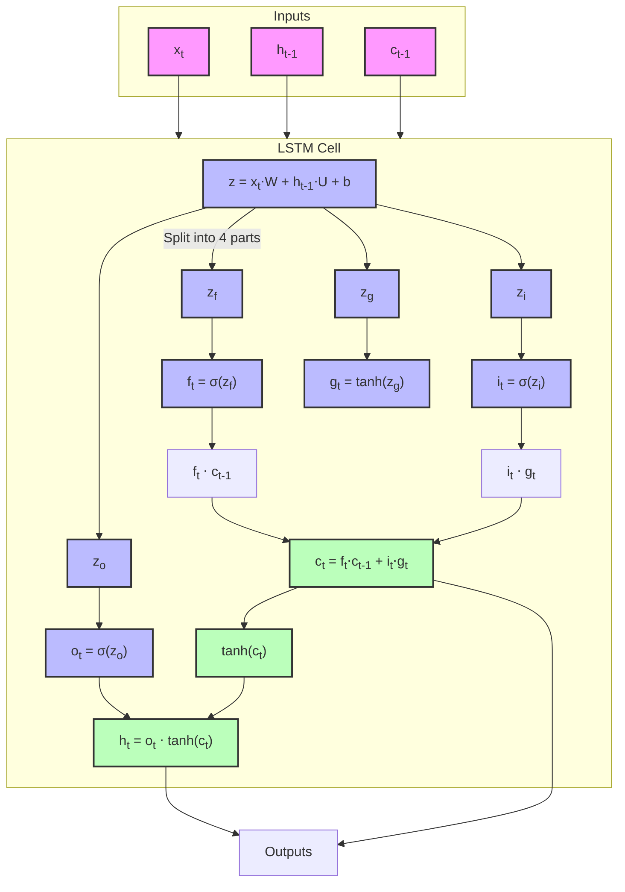
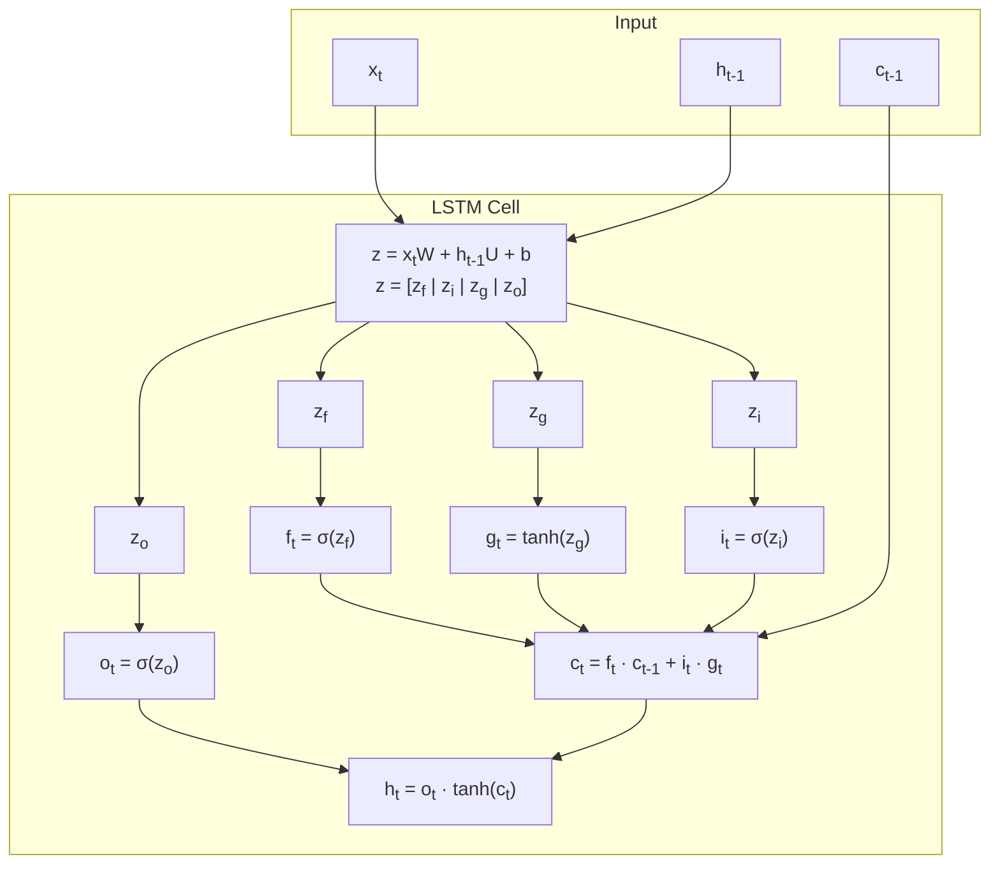
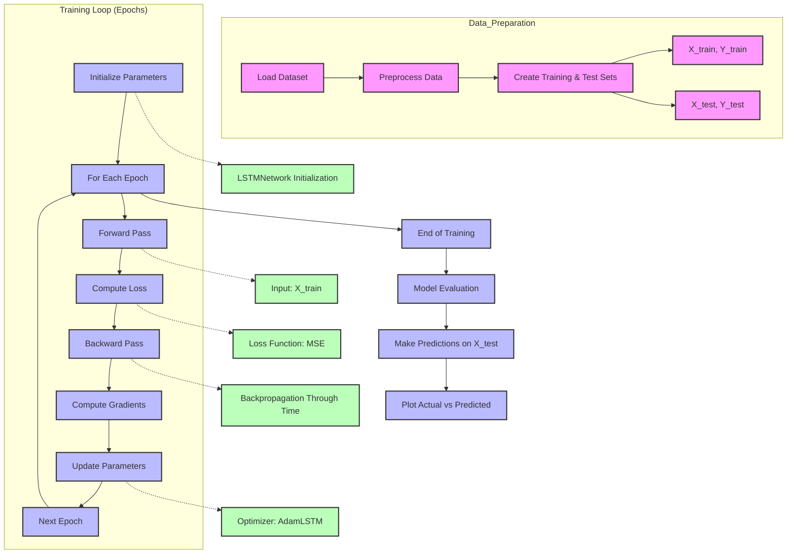
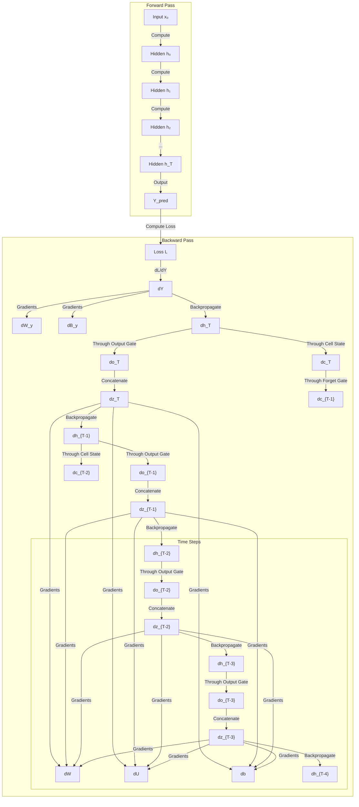
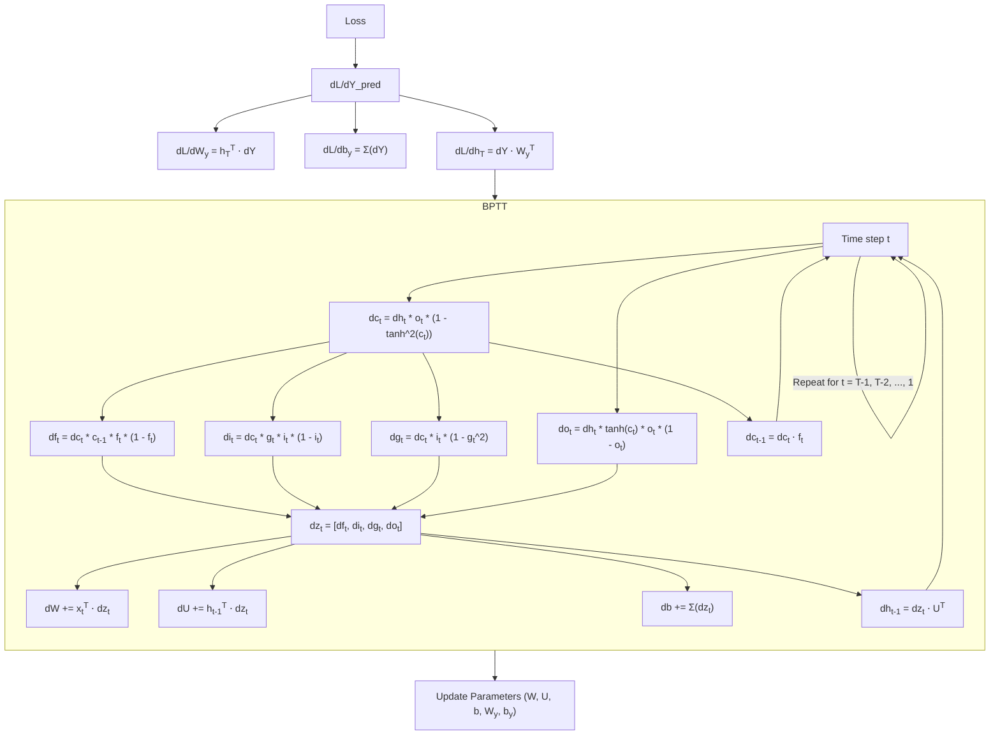

## RNN

$$h_t = \phi(W_{xh}x_t + W_{hh}h_{t-1} + b_h) \tag{1}$$
$$y_t = \psi(W_{hy}h_t + b_y) \tag{2}$$

**Loss function**: $$L = \sum_{t=1}^{T} L(y_t, \hat{y}_t) \tag{3}$$

**Backpropagation through time (BPTT)**

$$\frac{\partial L}{\partial W_{hy}} = \sum_{t=1}^{T} \frac{\partial L}{\partial y_t} \frac{\partial y_t}{\partial W_{hy}} \tag{4}$$

$$\frac{\partial y_t}{\partial W_{hy}} = \psi'(z_t)h_t^T \tag{5}$$

where: $$z_t = W_{hy}h_t + b_y \tag{6}$$

$$\frac{\partial L}{\partial W_{hh}} = \sum_{t=1}^{T} \frac{\partial L}{\partial h_t} \frac{\partial h_t}{\partial W_{hh}} \tag{7}$$

$$\frac{\partial h_t}{\partial W_{hh}} = \phi'(z_t)h_{t-1}^T \tag{8}$$

where: $$z_t = W_{xh}x_t + W_{hh}h_{t-1} + b_h \tag{9}$$

$$z = x_t \cdot W + h_{t-1} \cdot U + b$$

$$f_t = \sigma(z_f), z_f = x_t \cdot W_f + h_{t-1} \cdot U_f + b_f$$
$$i_t = \sigma(z_i)$$
$$g_t = \tanh(z_g)$$
$$o_t = \sigma(z_o)$$

$$c_t = f_t \cdot c_{t-1} + i_t \cdot g_t$$
$$h_t = o_t \cdot \tanh(c_t)$$

$$\hat{y}_{pred} = \text{Linear}(h_TW_y + b_y)$$

